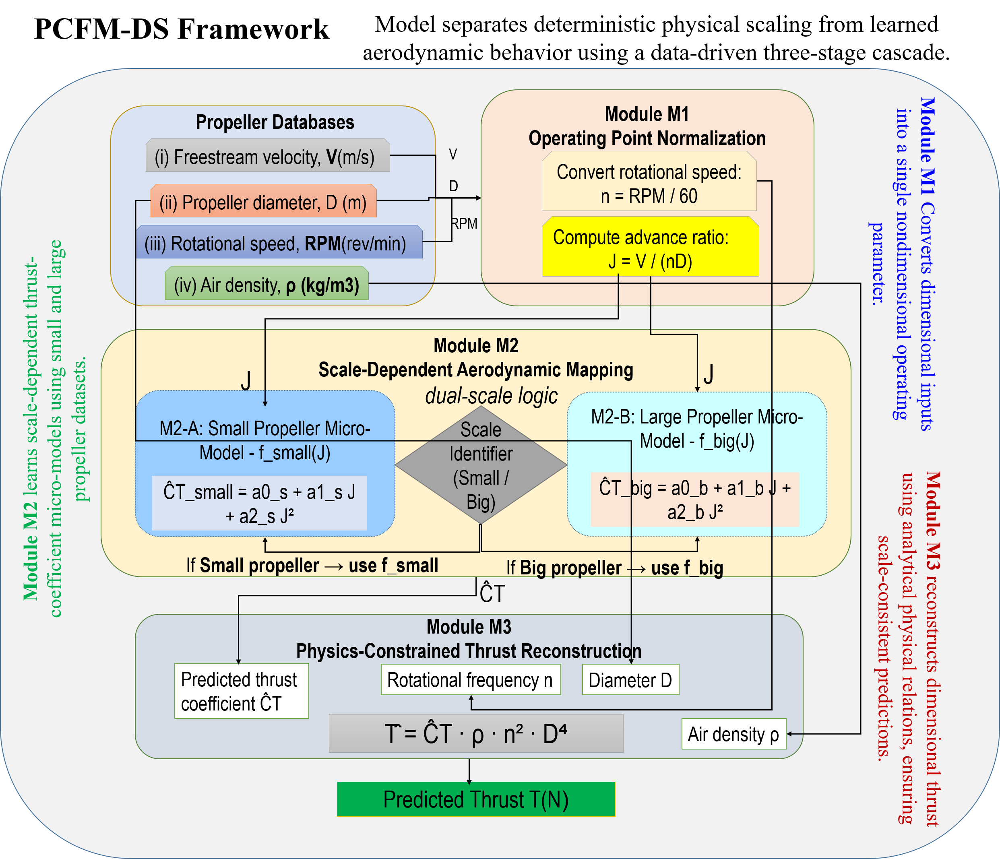
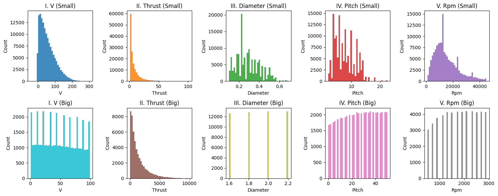
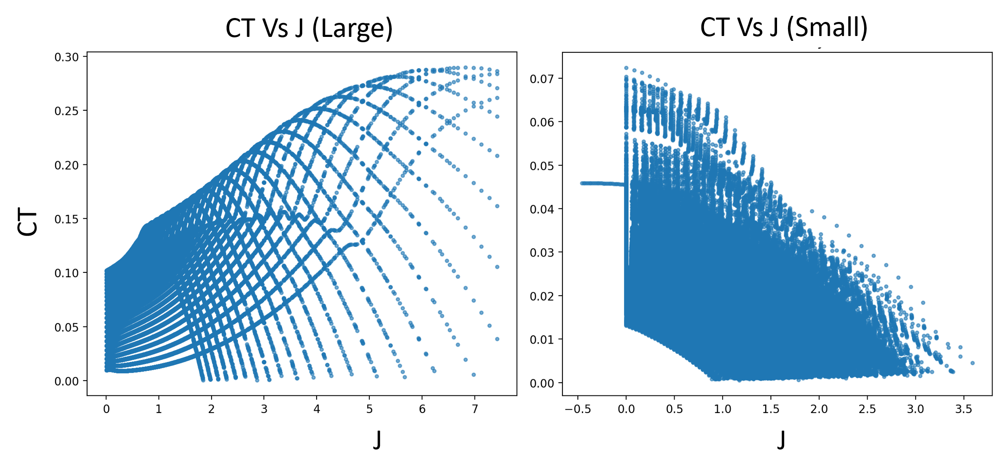

# 🚀 PCFM-DS: Physics-Compressed Dual-Scale Propeller Thrust Prediction
> **Physics-Compressed Cascaded Feature Micro-Models (Dual Scale)**\
> for **cross-scale, interpretable, and data-efficient propeller thrust
> prediction**

------------------------------------------------------------------------

## 🔍 Research Motivation & Gaps

Accurate propeller thrust modeling is a cornerstone of **Advanced Air
Mobility (AAM)** and\
**Distributed Electric Propulsion (DEP)** system design. Existing
approaches, however, suffer from:

-   ❌ **CFD dependency** → prohibitive computational cost\
-   ❌ **Pure black-box ML** → poor extrapolation and interpretability\
-   ❌ **Dimensional learning** → severe scale sensitivity\
-   ❌ **Lack of cross-scale validation**\
-   ❌ **Poor data efficiency**

### 🧩 Research Gap Addressed

PCFM-DS bridges the gap between **physics-based scaling laws** and
**data-driven learning** by:

-   Explicitly separating **deterministic physics** from **learned
    aerodynamics**
-   Learning exclusively in a **low-dimensional, nondimensional space**
-   Enabling **robust cross-scale transfer** from small UAV propellers
    to large AAM propellers

------------------------------------------------------------------------

## ✨ Key Novelty (Why PCFM-DS is New)

-   ✅ Physics-compressed **cascaded learning formulation**
-   ✅ Explicit **analytical thrust reconstruction**
-   ✅ **Dual-scale micro-models** without added complexity
-   ✅ **Millisecond-level training**, constant-time inference
-   ✅ Robust under **90% data reduction**
-   ✅ First framework validated on **heterogeneous small + large
    propeller datasets**

------------------------------------------------------------------------

## 🧠 Core Idea: Physics-Compressed Cascade

Instead of learning thrust directly:

    (V, D, RPM) → T

PCFM-DS reformulates the task as a structured cascade:

    (V, D, RPM) → J → C_T → T

Where: - **J** : Advance ratio (physics-normalized operating point) -
**C_T** : Thrust coefficient (learned aerodynamics) - **T** :
Dimensional thrust (analytically reconstructed)

This reformulation removes scale effects from learning and enforces
physical consistency.

------------------------------------------------------------------------

## 🧩 Model Architecture (PCFM-DS)

<p align="center">
  
</p>
### 🔹 Module M1 -- Operating Point Normalization

-   Rotational frequency:

```{=html}
<!-- -->
```
    n = RPM / 60

-   Advance ratio:

```{=html}
<!-- -->
```
    J = V / (nD)

### 🔹 Module M2 -- Dual-Scale Aerodynamic Micro-Models

Separate low-order polynomial models are trained for small and large
propellers:

    C_T = a0 + a1·J + a2·J²

This captures Reynolds-number-dependent aerodynamic trends without
increasing model size.

### 🔹 Module M3 -- Physics-Constrained Thrust Reconstruction

Dimensional thrust is reconstructed analytically:

    T = C_T · ρ · n² · D⁴

✔ No learned scaling\
✔ Guaranteed dimensional consistency\
✔ Bounded extrapolation behavior

------------------------------------------------------------------------

## 📊 Datasets & Experimental Setup

### 📈 Paired Dataset Statistics

<p align="center">
  
</p>
-   **Small propellers**: UAV-scale, diverse geometries (UIUC database)
-   **Large propellers**: AAM-scale, controlled in-house experiments

### 🧪 Large-Scale Experimental Validation

<p align="center">
  
  
</p>

-   (Left) Calibrated thrust test rig
-   (Right) Distinct CT--J trends across propeller scales

------------------------------------------------------------------------

## 🧪 Capability-Based Comparison (Literature Gap)

  --------------------------------------------------------------------------------------
  Domain /      Dataset /   ML         ND         Phys       XS         Key Limitations
  Application   Scale                                                   
  ------------- ----------- ---------- ---------- ---------- ---------- ----------------
  Electric      Lab-scale   ✓          ✗          ✗          ✗          Scale-specific
  thrusters                                                             

  UAV fault     UAV sensors ✓          ✗          ✗          ✗          No thrust model
  diagnosis                                                             

  Marine        Marine      ✗          ✓          ✓          ✗          No cross-scale
  propellers                                                            

  CFD propeller CFD         ✓          ✗          ✗          ✗          High cost
  design                                                                

  ML-assisted   CFD         ✓          ✗          ✗          ✗          No XS
  design                                                                

  Performance   UAV tests   ✗          ✓          ✓          ✗          Manual
  maps                                                                  

  Noise         Acoustic    ✓          ✗          ✗          ✗          No thrust
  prediction                                                            

  UUV control   Simulated   ✓          ✗          ✗          ✗          App-specific

  **PCFM-DS     Small +     ✓          ✓          ✓          ✓          ---
  (This work)** Large                                                   
  --------------------------------------------------------------------------------------

**ML**: machine learning, **ND**: nondimensional learning,\
**Phys**: explicit physics scaling, **XS**: cross-scale validation

------------------------------------------------------------------------

## 📈 Architecture Ablation (Why Each Component Matters)

  -------------------------------------------------------------------------------
  Model         R²          MAE         NTE         PCE         Remarks
  ------------- ----------- ----------- ----------- ----------- -----------------
  Raw-ML        0.60        290         0.030       0.60        Scale-sensitive
  (Ridge)                                                       

  Random Forest 0.79        186         0.018       0.79        Overfits

  PCFM-Base     0.50        225         0.023       0.61        No scale
                                                                separation

  **PCFM-DS**   **0.80**    **143**     **0.015**   **0.92**    Robust &
                                                                interpretable

  PCFM-DS (No   0.43        320         0.033       ≈ 0         Physics broken
  Cascade)                                                      
  -------------------------------------------------------------------------------

➡ Cascading + physics compression are **essential**.

------------------------------------------------------------------------

## 📉 Data Efficiency (Limited Data Regime)

  Training Data   R²      MAE
  --------------- ------- -------
  100%            0.799   142.9
  25%             0.799   142.8
  10%             0.799   142.5
  Raw-ML (10%)    0.599   290.7

➡ **90% data reduction with no performance loss**

------------------------------------------------------------------------

## ⚡ Computational Efficiency

  Model           Training Time (ms)   Parameters
  --------------- -------------------- ------------
  Random Forest   540                  100+
  Ridge           225                  10+
  **PCFM-DS**     **1.2**              **3**

✔ Real-time capable\
✔ Edge-deployable

------------------------------------------------------------------------

## 🧠 Feature Efficiency & Physics Alignment

  Feature                 R²         Dim     PAES
  ----------------------- ---------- ------- ----------
  Diameter                0.45       1       0.33
  RPM                     0.65       1       0.47
  PCA (6)                 0.65       6       0.29
  **Advance Ratio (J)**   **0.65**   **1**   **0.47**

➡ Physics-derived features outperform statistical compression.

------------------------------------------------------------------------

## ⚖️ Ethics, Safety & Explainability

  Metric                     PCFM-DS
  -------------------------- ---------
  Ethical Simplicity Index   Low
  Fail-through Safety        Yes
  FLOPs                      O(1)
  Decision Robustness        4 / 4
  Feature Count              1

------------------------------------------------------------------------

## 📚 Comparison with State-of-the-Art

  Method        Physics   Cost           Generalization
  ------------- --------- -------------- -----------------
  CFD           ✓         High           High
  Pure ML       ✗         Low            Poor
  **PCFM-DS**   ✓         **Very Low**   **Cross-scale**

------------------------------------------------------------------------

## 📂 Repository Structure

    PCFM-DS-PropellerThrustPrediction/
    ├── Code/
    ├── Dataset/
    ├── Results/
    │   ├── Figures/
    │   ├── Tables/
    │   ├── logs/
    │   ├── models/
    │   └── predictions/
    └── README.md

------------------------------------------------------------------------

## 📌 Citation

``` bibtex
@article{PCFMDS2025,
  title={Physics-Compressed Cascaded Micro-Models for Cross-Scale Propeller Thrust Prediction},
  author={Alam, M. I. and Khan, M. U. and Suleman, A. and Kaleem, Z.},
  journal={IEEE Access},
  year={2025}
}
```

✔ Physics-first ML\
✔ Ready for journal, thesis, and industry review

If you find this work useful, please **star ⭐ the repository**.
