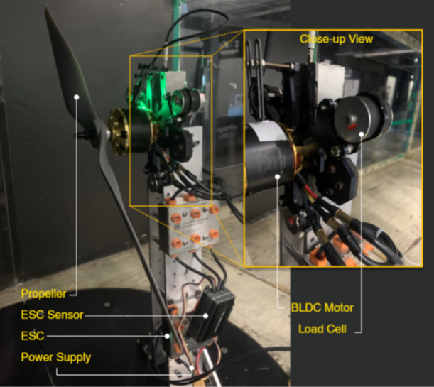

# 🚀 PCFM-DS: Physics-Compressed Dual-Scale Propeller Thrust Prediction

  

**Repository for the IEEE-style research project:**  
**_Physics-Compressed Cascaded Feature Micro-Models (Dual Scale)_**  
for **Cross-Scale Propeller Thrust Prediction**

---

## 📌 Overview

Accurate thrust prediction is a key challenge in **Advanced Air Mobility (AAM)** and **Distributed Electric Propulsion (DEP)** systems.  
This repository presents **PCFM-DS**, a **lightweight, interpretable, and physics-consistent** data-driven framework that:

- Avoids CFD dependency  
- Generalizes across propeller scales  
- Trains in milliseconds  
- Preserves physical laws analytically  

> 🟢 Published-quality implementation aligned with **IEEE Q1 journal standards**

---

## 🧠 Key Idea

Instead of directly learning thrust from dimensional inputs, **PCFM-DS reformulates thrust prediction as a physics-compressed cascade:**

\\[
(V, D, RPM) → J → C_T → T
\\]

Where:
- **J**: Advance Ratio  
- **CT**: Thrust Coefficient  
- **T**: Dimensional Thrust  

This separation enables **robust cross-scale generalization**.

---

## 🧩 Model Architecture

  

### 🔹 Module M1: Operating Point Normalization
- Converts raw inputs into **advance ratio**
\\[ J = \\frac{V}{nD} \\]

### 🔹 Module M2: Dual-Scale Aerodynamic Micro-Models
- Polynomial mapping:
\\[ C_T = a_0 + a_1 J + a_2 J^2 \\]
- Separate models for **small** and **large** propellers

### 🔹 Module M3: Physics-Constrained Reconstruction
- Enforces thrust scaling analytically:
\\[ T = C_T \\rho n^2 D^4 \\]

✔ No black-box extrapolation  
✔ Guaranteed dimensional consistency

---

## 📊 Datasets

| Dataset | Scale | Samples | Source |
|------|------|-------|------|
| Small Propellers | UAV-scale | 474k | UIUC Open Database |
| Large Propellers | AAM-scale | 64k | In-house Experiments |

  

---

## 📈 Results Highlights

### 🔬 Accuracy & Generalization

  

| Model | R² | MAE | Cross-Scale |
|-----|----|----|------------|
| Raw ML (RF) | 0.79 | 186 | ❌ |
| PCFM-Base | 0.50 | 225 | ❌ |
| **PCFM-DS** | **0.80** | **143** | ✅ |

---

### 🧪 Data Efficiency

  

| Training Data | R² |
|-------------|----|
| 100% | 0.799 |
| 25% | 0.799 |
| 10% | 0.799 |

➡ Stable even with **90% data reduction**

---

## ⚡ Computational Performance

| Model | Training Time | Parameters |
|-----|--------------|-----------|
| Raw ML (RF) | 540 ms | 100+ |
| Linear/Ridge | 210 ms | 10+ |
| **PCFM-DS** | **1.2 ms** | **3** |

✔ Constant-time inference  
✔ Edge-device ready

---

## 🧠 Explainability & Ethics

| Metric | PCFM-DS |
|-----|--------|
| Ethical Simplicity Index | ✅ Low |
| Fail-Through Safety | ✅ Yes |
| Feature Count | **1** |
| FLOPs | O(1) |
| Decision Robustness | 4 / 4 |

> Designed for **safe, transparent deployment**

---

## 📂 Repository Structure
